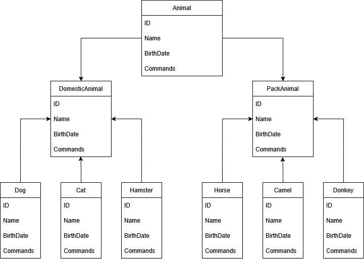

"# GB_Dev_Proger_Exam" 

Разработчик - Программист. Специализация.

Итоговая контрольная работа по блоку специализация.

Задание:
1. Используя команду cat в терминале операционной системы Linux, создать
   два файла Домашние животные заполнив файл собаками, кошками,
   хомяками и Вьючные животными заполнив файл Лошадьми, верблюдами и
   ослами, а затем объединить их. Просмотреть содержимое созданного файла.
   Переименовать файл, дав ему новое имя (Друзья человека).
2. Создать директорию, переместить файл туда.
3. Подключить дополнительный репозиторий MySQL. Установить любой пакет
   из этого репозитория.
4. Установить и удалить deb-пакет с помощью dpkg.
5. Выложить историю команд в терминале ubuntu
6. Нарисовать диаграмму, в которой есть класс родительский класс, домашние
   животные и вьючные животные, в составы которых в случае домашних
   животных войдут классы: собаки, кошки, хомяки, а в класс вьючные животные
   войдут: Лошади, верблюды и ослы).
7. В подключенном MySQL репозитории создать базу данных “Друзья
   человека”
8. Создать таблицы с иерархией из диаграммы в БД
9. Заполнить низкоуровневые таблицы именами(животных), командами
   которые они выполняют и датами рождения
10. Удалив из таблицы верблюдов, т.к. верблюдов решили перевезти в другой
    питомник на зимовку. Объединить таблицы лошади, и ослы в одну таблицу.
11. Создать новую таблицу “молодые животные” в которую попадут все
    животные старше 1 года, но младше 3 лет и в отдельном столбце с точностью
    до месяца подсчитать возраст животных в новой таблице
12. Объединить все таблицы в одну, при этом сохраняя поля, указывающие на
    прошлую принадлежность к старым таблицам.
13. Создать класс с Инкапсуляцией методов и наследованием по диаграмме.
14. Написать программу, имитирующую работу реестра домашних животных.
    В программе должен быть реализован следующий функционал:  
    14.1. Завести новое животное  
    14.2. Определять животное в правильный класс  
    14.3. Увидеть список команд, которое выполняет животное  
    14.4. Обучить животное новым командам  
    14.5. Реализовать навигацию по меню  
15. Создайте класс Счетчик, у которого есть метод add(), увеличивающий̆
    значение внутренней int переменной̆на 1 при нажатии “Завести новое
    животное”. Сделайте так, чтобы с объектом такого типа можно было работать в
    блоке try-with-resources. Нужно бросить исключение, если работа с объектом
    типа счетчик была не в ресурсном try и/или ресурс остался открыт. Значение
    считать в ресурсе try, если при заведения животного заполнены все поля.

Решение:
1.
gb@GBPracticeCommandPromt:~/pitomnik$ cat > DomesticAnimal.txt
Собака
Кошка
Хомяк

gb@GBPracticeCommandPromt:~/pitomnik$ cat > PackAnimal.txt
Лошадь
Верблюд
Оcел

gb@GBPracticeCommandPromt:~/pitomnik$ cat DomesticAnimal.txt PackAnimal.txt > Animals.txt

gb@GBPracticeCommandPromt:~/pitomnik$ tail ./Animals.txt
Собака
Кошка
Хомяк
Лошадь
Верблюд
Оcел

gb@GBPracticeCommandPromt:~/pitomnik$ mv Animals.txt HumanFriends.txt

2.
gb@GBPracticeCommandPromt:~/pitomnik$ mkdir PetsDirectory

gb@GBPracticeCommandPromt:~/pitomnik$ mv HumanFriends.txt PetsDirectory

3.
gb@GBPracticeCommandPromt:~/pitomnik$ sudo apt-get install mysql-server

4.
sudo dpkg -i mysql-apt-config_0.8.33-1_all.deb

5.
db@GBPracticeCommandPromt:~/pitomnik$ history
343  mkdir pitomnik
344  ls -al
345  cd ~/pitomnik/
346  cat pets.txt
347  cat > DomesticAnimal.txt
348  ls -al
349  tail ./DomesticAnimal.txt
350  nano ./DomesticAnimal.txt
351  cat > PackAnimal.txt
352  stakhmichnv@GBPracticeCommandPromt:~/pitomnik$ cat > PackAnimal.txt
353  Лошадь
354  Верблюд
355  Оcел
356  cat DomesticAnimal.txt PackAnimal.txt > Animal.txt
357  tail ./Animal.txt
358  tail ./PackAnimal.txt.txt
359  stakhmichnv@GBPracticeCommandPromt:~/pitomnik$ cat > ./PackAnimal.txt
360  stakhmichnv@GBPracticeCommandPromt:~/pitomnik$ cat > PackAnimal.txt
361  ls -al
362  tail ./PackAnimal.txt
363  stakhmichnv@GBPracticeCommandPromt:~/pitomnik$ cat > PackAnimal.txt
364  rm ./PackAnimal.txt
365  cat > PackAnimal.txt
366  rm ./Animals.txt
367  rm ./Animal.txt
368  cat DomesticAnimal.txt PackAnimal.txt > Animals.txt
369  tail ./Animals.txt
370  cat ./Animals.txt
371  mv Animals.txt HumanFriends.txt
372  ls -al
373  ls
374  mkdir PetsDirectory
375  mv HumanFriends.txt PetsDirectory
376  ls ./PetsDirectory/
377  sudo apt-get update
378  sudo apt-get install mysql-server
379  mysql --version
380  sudo dpkg -i mysql-apt-config_0.8.33-1_all.deb
381  history

6.

7.
create database human_friends;
use human_friends;

8.
CREATE TABLE human_friends
(
	id_human_friend INT PRIMARY KEY AUTO_INCREMENT,
	type VARCHAR(20)
);

CREATE TABLE domestic_animals
(
	id_domestic_animal INT AUTO_INCREMENT PRIMARY KEY,
	id_human_friend INT,
	type VARCHAR(20) unique,
	FOREIGN KEY (id_human_friend) REFERENCES human_friends (id_human_friend) ON DELETE SET NULL
);

CREATE TABLE pack_animals
(
	id_pack_animal INT AUTO_INCREMENT PRIMARY KEY,
	id_human_friend INT,
	type VARCHAR(20),
	FOREIGN KEY (id_human_friend) REFERENCES human_friends (id_human_friend) ON DELETE SET NULL
);

CREATE TABLE cats
(
	id_cat INT PRIMARY KEY AUTO_INCREMENT,
	id_domestic_animal INT,
	name VARCHAR(40),
	birthdate DATE,
	commands TEXT,
	FOREIGN KEY (id_domestic_animal) REFERENCES domestic_animals (id_domestic_animal) ON DELETE SET NULL
);

CREATE TABLE dogs
(
	id_dog INT PRIMARY KEY AUTO_INCREMENT,
	id_domestic_animal INT,
	name VARCHAR(40),
	birthdate DATE,
	commands TEXT,
	FOREIGN KEY (id_domestic_animal) REFERENCES domestic_animals (id_domestic_animal) ON DELETE SET NULL
);

CREATE TABLE hamsters
(
	id_hamster INT PRIMARY KEY AUTO_INCREMENT,
	id_domestic_animal INT,
	name VARCHAR (40),
	birthdate DATE,
	commands TEXT,
	FOREIGN KEY (id_domestic_animal) REFERENCES domestic_animals (id_domestic_animal) ON DELETE SET NULL
);

CREATE TABLE horses
(
	id_horse INT PRIMARY KEY AUTO_INCREMENT,
	id_pack_animal INT,
	name VARCHAR(40),
	birthdate DATE,
	commands TEXT,
	FOREIGN KEY (id_pack_animal) REFERENCES pack_animals (id_pack_animal) ON DELETE SET NULL
);

CREATE TABLE camels
(
	id_camel INT PRIMARY KEY AUTO_INCREMENT,
	id_pack_animal INT,
	name VARCHAR(40),
	birthdate DATE,
	commands TEXT,
	FOREIGN KEY (id_pack_animal) REFERENCES pack_animals (id_pack_animal) ON DELETE SET NULL
);

CREATE TABLE donkeys
(
	id_donkey INT PRIMARY KEY AUTO_INCREMENT,
	id_pack_animal INT,
	name VARCHAR(40),
	birthdate DATE,
	commands TEXT,
	FOREIGN KEY (id_pack_animal) REFERENCES pack_animals (id_pack_animal) ON DELETE SET NULL
);

9.
insert into human_friends (type) values ('domestic_animals'), ('pack_animals');
alter table domestic_animals alter column id_human_friend set default 1;
insert into domestic_animals (type) values ('cat'), ('dog'), ('hamster');
alter table pack_animals alter column id_human_friend set default 2;
insert into pack_animals (type) values ('horse'), ('camel'), ('donkey');

INSERT INTO cats (id_domestic_animal, name, birthdate, commands) values
	(1, 'Whiskers', '2019-05-15', 'Sit, Pounce'),
	(1, 'Smudge', '2020-02-20', 'Sit, Pounce, Scratch'),
	(1, 'Oliver', '2020-06-30', 'Meow, Scratch, Jump');

INSERT INTO dogs (id_domestic_animal, name, birthdate, commands) VALUES
	(2, 'Fido', '2020-01-01', 'Sit, Stay, Fetch'),
	(2, 'Buddy','2018-12-10', 'Sit, Paw, Bark'),
	(2, 'Bella', '2019-11-11', 'Sit, Stay, Roll');

INSERT INTO hamsters (id_domestic_animal, name, birthdate, commands) VALUES
	(3, 'Hammy', '2021-03-10', 'Roll, Hide'),
	(3, 'Peanut', '2021-08-01', 'Roll, Spin');

insert into horses (id_pack_animal, name, birthdate, commands) values
	(1, 'Thunder', '2015-07-21', 'Trot, Canter, Gallop'),
	(1, 'Storm', '2014-05-05', 'Trot, Canter'),
	(1, 'Blaze', '2016-02-29', 'Trot, Jump, Gallop');

insert into camels (id_pack_animal, name, birthdate, commands) values
	(2, 'Sandy', '2016-11-03', 'Walk, Carry Load'),
	(2, 'Dune', '2018-12-12', 'Walk, Sit'),
	(2, 'Sahara', '2015-08-14', 'Walk, Run');

insert into donkeys (id_pack_animal, name, birthdate, commands) values
	(3, 'Eeyore', '2017-09-18', 'Walk, Carry Load, Bray'),
	(3, 'Burro', '2019-01-23', 'Walk, Bray, Kick');

10.
truncate table camels;

CREATE TABLE combined_animals AS
	SELECT * FROM domestic_animals
	UNION ALL
	SELECT * FROM pack_animals;

11.
create table young_animals
with t as (with p_a as (with hd as (
select id_pack_animal, name, birthdate from horses
UNION ALL
select id_pack_animal, name, birthdate from donkeys)
select hd.name as name, hd.birthdate as birthdate, pa.type as type
from pack_animals as pa
right join hd
on hd.id_pack_animal = pa.id_pack_animal),
p_s as (with ps as (
select id_domestic_animal, name, birthdate from cats
UNION ALL
select id_domestic_animal, name, birthdate from dogs
UNION ALL
select id_domestic_animal, name, birthdate from hamsters)
select ps.name as name, ps.birthdate as birthdate, da.type as type
from domestic_animals as da
right join ps
on ps.id_domestic_animal = da.id_domestic_animal)
select * from p_a
union all
select * from p_s)
select ROW_NUMBER() OVER (ORDER BY name) as seq_numb, t.*,
concat(FLOOR(datediff(CURDATE(), birthdate) /30/12), ' years, ',
FLOOR(datediff(CURDATE(), birthdate) /30) - FLOOR(datediff(CURDATE(), birthdate) /30/12)*12, ' months')
as Age from t
where FLOOR(datediff(CURDATE(), birthdate) /30/12) >= 1 and FLOOR(datediff(CURDATE(), birthdate) /30/12) <3;

12.
CREATE TABLE all_animals AS
	SELECT id_domestic_animal, null AS id_pack_animal, name, birthdate FROM cats
	UNION
	SELECT id_domestic_animal, null AS id_pack_animal, name, birthdate FROM dogs
	UNION
	SELECT id_domestic_animal, null AS id_pack_animal, name, birthdate FROM hamsters
	UNION
	SELECT null AS id_domestic_animal, id_pack_animal, name, birthdate FROM horses
	UNION
	SELECT null AS id_domestic_animal, id_pack_animal, name, birthdate FROM donkeys;

Функционал приложения:  
Добавить животное, выбрав при этом вид животного  
Удалить животное, выбрав его по индексу  
Научить животное новой команде, выбрав его по индексу  
Посмотреть список команд животного, выбрав его по индексу  
Создать заполненный реестр животных  
Вывести реестр имеющихся животных  
Сохранить реестр имеющихся животных в файл  
Загрузить сохраненный реестр животных из файла  
Выйти.